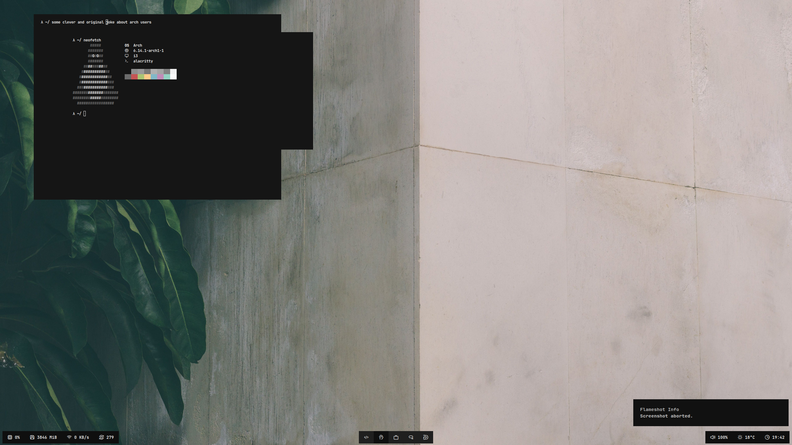
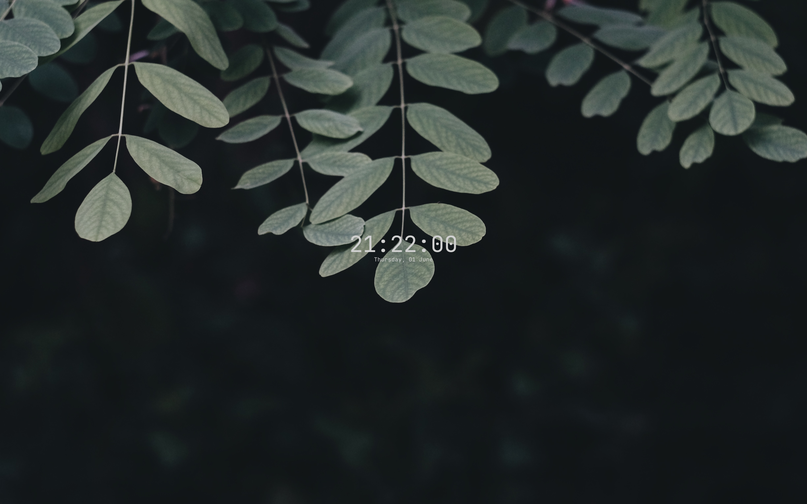
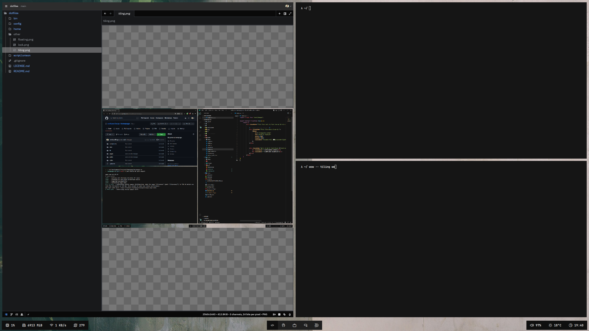

# dotfiles

Hey there. This repository contains my personal dotfiles. Nothing more to say.

|  |  |  |
| :---------------------: | :-----------------: | :-------------------: |
|        Floating         |        Lock         |        Tiling         |

## Apps

A quick run-down on the basic applications I use:

| Use-Case | Application |
| :---: | :---: |
| Window manager| [i3-wm](https://i3wm.org/) |
| Status Bar | [Polybar](https://github.com/polybar/polybar) with [custom weather module](https://github.com/confusedSerge/polybar-weather) |
| Terminal emulator| [alacritty](https://github.com/alacritty/alacritty)|
| Shell | [zsh](https://www.zsh.org/) with [oh-my-zsh](https://ohmyz.sh/) |
| Application launcher | [rofi](https://github.com/davatorium/rofi) |
| Editor | [vim](https://www.vim.org/), [zed](https://zed.dev/), whatever fits the bill |
| Sync | [Unison](https://github.com/bcpierce00/unison) & [rsync](https://en.wikipedia.org/wiki/Rsync) |
| Wallpapers | [Background](https://unsplash.com/photos/RONnMobq0_Y) & [Lockscreen](https://unsplash.com/photos/CBh4D3l0EwM) |
| Fonts | [JetBrains Mono](https://www.jetbrains.com/lp/mono/) & [Iconoir](https://github.com/iconoir-icons/iconoir) |
